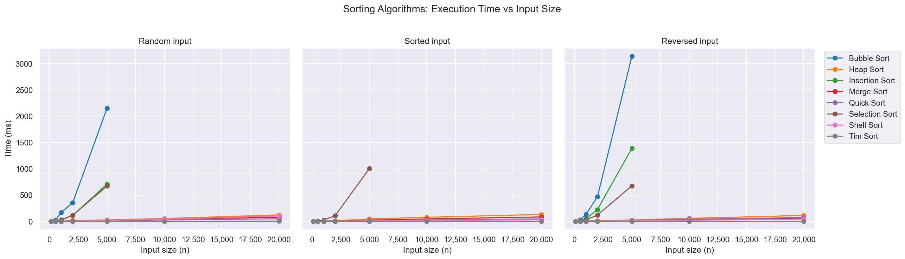
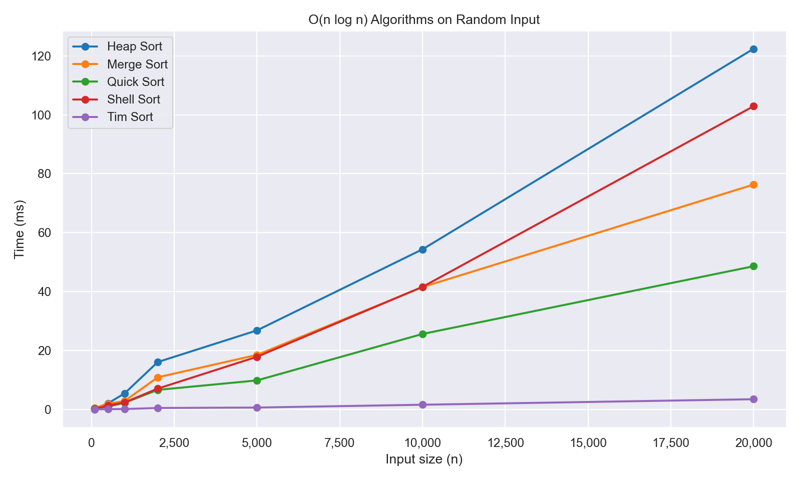
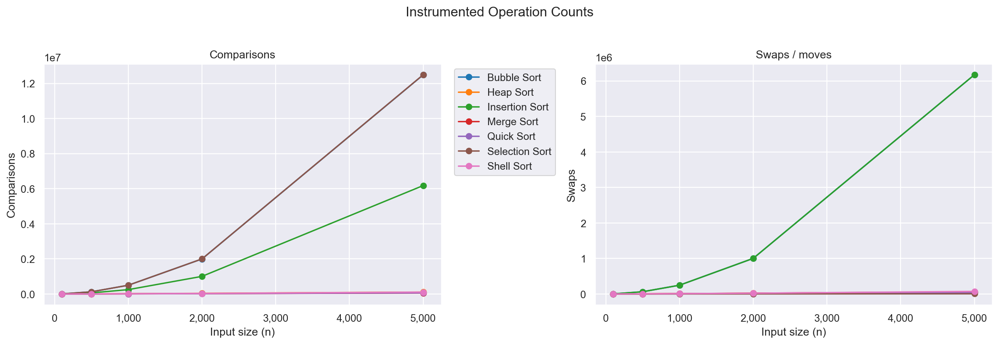
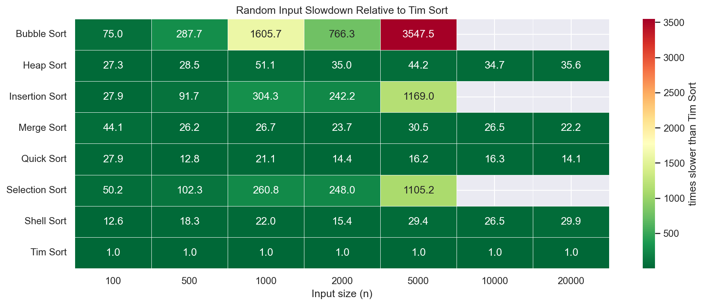

# Sorting Algorithm Comparison

## Context

This repository was built to compare sorting algorithms from two perspectives:

- Theoretical complexity (Big-O, documented in code comments).
- Experimental behavior (runtime and operation counts).

It includes 8 algorithms:

- Bubble Sort
- Insertion Sort
- Selection Sort
- Merge Sort
- Quick Sort
- Heap Sort
- Shell Sort
- Tim Sort

The project also supports live validation where a custom array is provided in real time and analyzed immediately.

## Repository Structure

```text
Algorithm-Analysis/
├── algorithms/
│   ├── __init__.py
│   ├── sorting.py
│   └── sorting_instrumented.py
├── tests/
│   ├── test_sorting.py
│   └── test_sorting_instrumented.py
├── data/
│   ├── results.csv
│   ├── results_all_scenarios.csv
│   ├── results_operations.csv
│   ├── results_random.csv
│   ├── results_sorted.csv
│   ├── results_reversed.csv
│   ├── live_demo_summary.json
│   └── live_demo_results.csv
├── plots/
│   ├── time_by_scenario.png
│   ├── nlogn_random_zoom.png
│   ├── operation_counts.png
│   └── slowdown_heatmap.png
├── analysis.ipynb
├── benchmark.py
├── benchmark_scenarios.py
├── live_demo.py
├── plot_results.py
├── requirements.txt
└── .github/workflows/ci.yml
```

## What Is Measured

- Runtime by scenario: random, sorted, reversed.
- Comparisons and swaps/moves through instrumented versions.
- Visual trends with static charts and notebook exploration.

## Installation

```bash
pip install -r requirements.txt
```

## How To Execute The Full Workflow

```bash
# 1) Run unit tests (correctness + instrumented checks)
pytest tests/ -v

# 2) Generate benchmark CSV files
python benchmark_scenarios.py

# 3) Generate plots from benchmark data
python plot_results.py

# 4) Open interactive notebook (optional)
jupyter notebook analysis.ipynb
```

Note: python benchmark.py is kept as a compatibility wrapper for benchmark_scenarios.py.

## How To Test In Real Time (Oral Defense)

Use the live script with a custom array provided by the professor:

```bash
python live_demo.py --arr "9,3,5,1,8,2,7,4,6" --save
```

You can also pass JSON list format:

```bash
python live_demo.py --arr "[9,3,5,1,8,2,7,4,6]" --save
```

What this command shows in terminal:

- Input array
- Whether all algorithms agree on the same sorted output
- Sorted output
- Per-algorithm runtime for that exact input
- Instrumented comparisons and swaps/moves

What this command saves:

- data/live_demo_summary.json
- data/live_demo_results.csv

## Generated Visualizations

### 1) Time by scenario



### 2) O(n log n) zoom (random input)



### 3) Operation counts



### 4) Slowdown heatmap vs Tim Sort



## Notes

- Runtime benchmarks reuse the same sampled arrays across algorithms for fair comparison.
- Operation counts are intended to validate growth trends, not CPU-specific performance.
- In merge sort and shell sort, swaps should be interpreted as element moves/placements.
